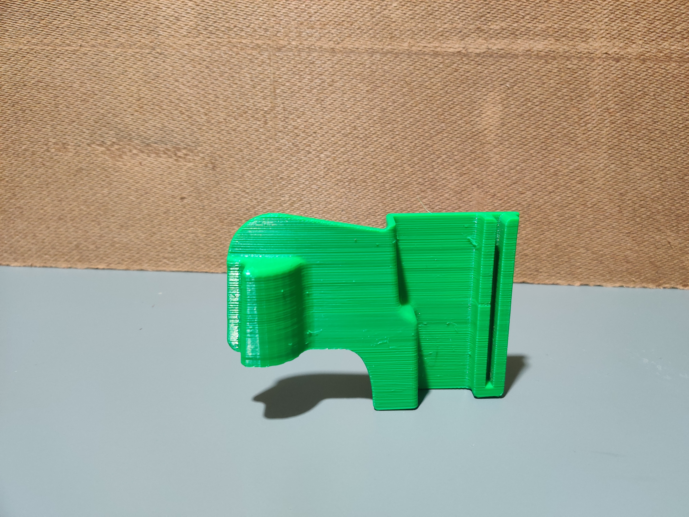
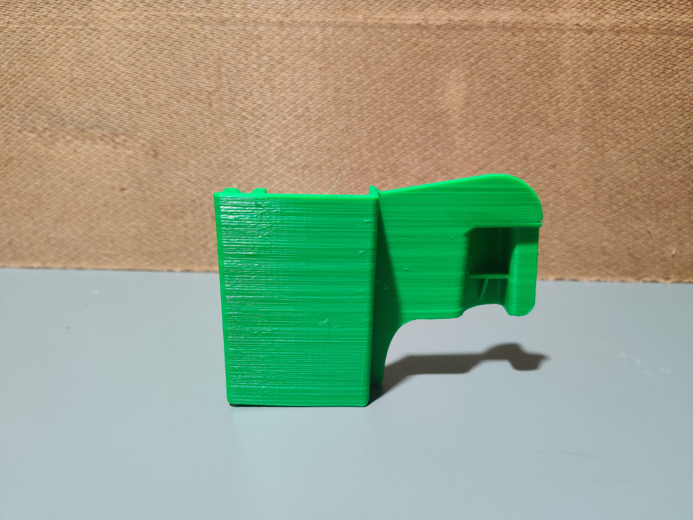
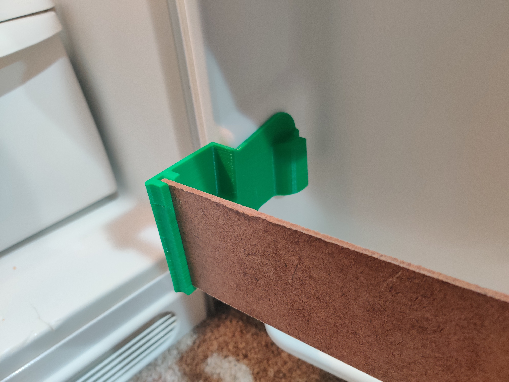
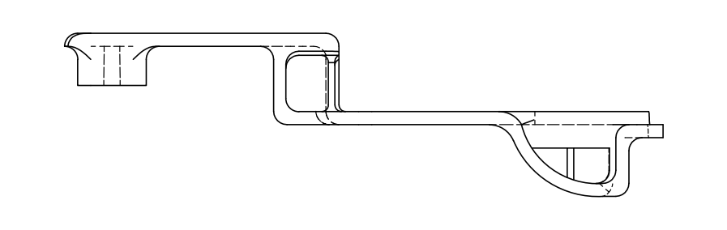
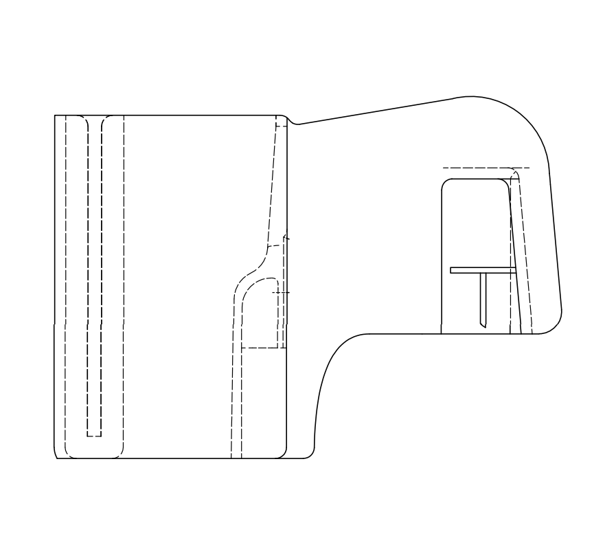
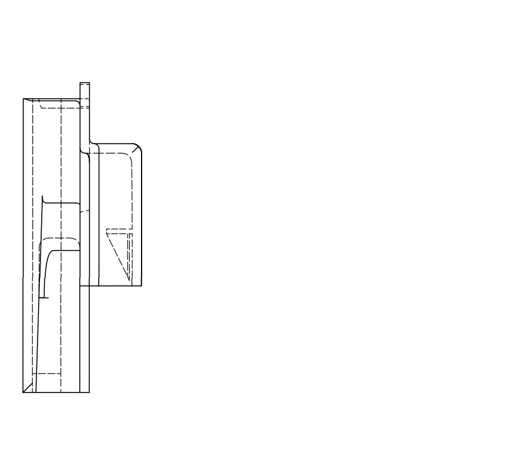
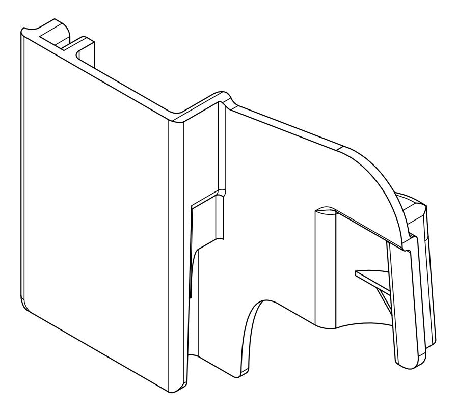
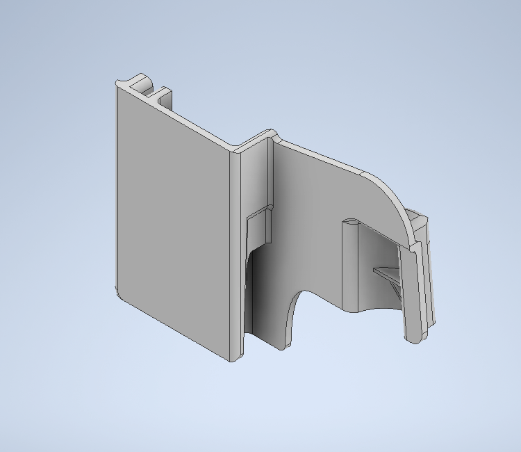
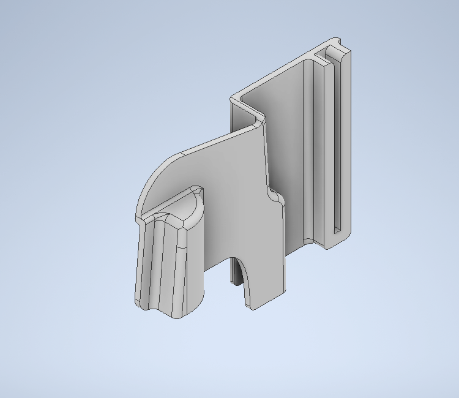

<!-- Improved compatibility of back to top link: See: https://github.com/othneildrew/Best-README-Template/pull/73 -->

<!--
*** Thanks for checking out the Best-README-Template. If you have a suggestion
*** that would make this better, please fork the repo and create a pull request
*** or simply open an issue with the tag "enhancement".
*** Don't forget to give the project a star!
*** Thanks again! Now go create something AMAZING! :D
-->

<!-- PROJECT SHIELDS -->
<!--
*** I'm using markdown "reference style" links for readability.
*** Reference links are enclosed in brackets [ ] instead of parentheses ( ).
*** See the bottom of this document for the declaration of the reference variables
*** for contributors-url, forks-url, etc. This is an optional, concise syntax you may use.
*** https://www.markdownguide.org/basic-syntax/#reference-style-links
-->
[![Contributors][contributors-shield]][contributors-url]
[![Forks][forks-shield]][forks-url]
[![Stargazers][stars-shield]][stars-url]
[![Issues][issues-shield]][issues-url]
[![MIT License][license-shield]][license-url]
[![LinkedIn][linkedin-shield]][linkedin-url]
[![Inventor][Inventor-badge]][Inventor-url]

<!-- PROJECT LOGO -->
 

  <!--  -->

<h3 align="center">Fridge Shelf</h3>
  

    3D models for a Frigidaire shelf bracket.
  

<!-- TABLE OF CONTENTS -->

  
Table of Contents

  <ol>
    <li><a href="#About">About</a></li>
    <li><a href="#Images">Images</a></li>
    <li><a href="#Model">Model</a></li>
    <li><a href="#license">License</a></li>
    <li><a href="#contact">Contact</a></li>
  </ol>

## About
This project was a fix for broken shelves in my fridge. The models were designed off of measurements from one of the unbroken shelves. Instead of modeling and printing the entire fridge shelf, I only modeled the connector part and cut some cheap board to use as the "guard".

(<a href="#readme-top">back to top</a>)

## Images

(<a href="#readme-top">back to top</a>)

## Model

   
   
  

     
     
     
  

 

   
   

(<a href="#readme-top">back to top</a>)

<!-- LICENSE -->
## License

Distributed under the MIT License. See `LICENSE.txt` for more information.

(<a href="#readme-top">back to top</a>)

<!-- CONTACT -->
## Contact

Jonathan Woolf  - jlwoolf@proton.me

Project Link: [https://github.com/jlwoolf/fridge-shelf](https://github.com/jlwoolf/fridge-shelf)

(<a href="#readme-top">back to top</a>)

<!-- MARKDOWN LINKS & IMAGES -->
<!-- https://www.markdownguide.org/basic-syntax/#reference-style-links -->
[contributors-shield]: https://img.shields.io/github/contributors/jlwoolf/fridge-shelf.svg?style=for-the-badge
[contributors-url]: https://github.com/jlwoolf/fridge-shelf/graphs/contributors
[forks-shield]: https://img.shields.io/github/forks/jlwoolf/fridge-shelf.svg?style=for-the-badge
[forks-url]: https://github.com/jlwoolf/fridge-shelf/network/members
[stars-shield]: https://img.shields.io/github/stars/jlwoolf/fridge-shelf.svg?style=for-the-badge
[stars-url]: https://github.com/jlwoolf/fridge-shelf/stargazers
[issues-shield]: https://img.shields.io/github/issues/jlwoolf/fridge-shelf.svg?style=for-the-badge
[issues-url]: https://github.com/jlwoolf/fridge-shelf/issues
[license-shield]: https://img.shields.io/github/license/jlwoolf/fridge-shelf.svg?style=for-the-badge
[license-url]: https://github.com/jlwoolf/fridge-shelf/blob/master/LICENSE.txt
[linkedin-shield]: https://img.shields.io/badge/-LinkedIn-black.svg?style=for-the-badge&logo=linkedin&colorB=555
[linkedin-url]: https://linkedin.com/in/jlwoolf
[product-screenshot]: images/screenshot.png
[Inventor-badge]: https://img.shields.io/badge/Inventor-dbae03?style=for-the-badge&logo=autodesk&logoColor=white
[Inventor-url]: https://autodesk.com/products/inventor/overview